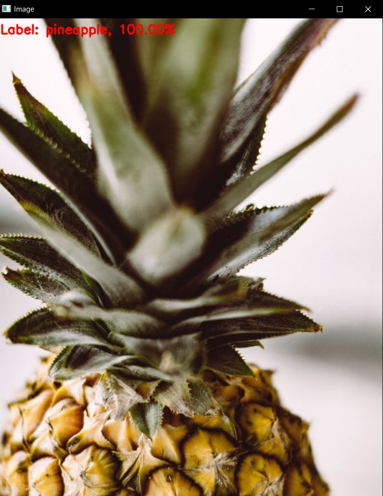
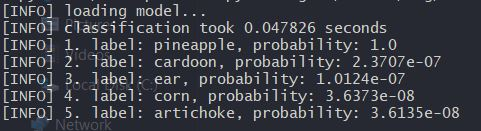

## Simple Object Detection System Using Pre-Trained Caffe Model And OpenCV
This project demonstrates a simple yet effective object detection system using a pre-trained Caffe model and OpenCV. The code allows users to perform object detection on images with minimal setup and effort.

### <u>Features</u>
 - <b>Simple Setup</b>: Just provide the paths to the input image, pre-trained model files, and labels, and you're ready to go.
 - <b>Fast Inference</b>: Utilizes a pre-trained Caffe model for efficient object detection.
 - <b>Visual Feedback</b>: Displays the top predictions overlaid on the input image, providing visual feedback on detected objects.
### Requirements
 - Python 3.x
 - NumPy
 - OpenCV
### <u>Usage</u>
 - Clone the repository:  
 `git clone https://github.com/giantspacemonster/SimpleObjectDetection.git`  

 - Install dependencies (Python3 and OpenCV)  
 `pip install numpy opencv-python`  

 - Download the GoogLeNet CaffeModel from http://dl.caffe.berkeleyvision.org/bvlc_googlenet.caffemodel  

 - Run the object detection script:  
 `python object_detection.py --image path/to/your/image.jpg --prototxt ./bvlc_googlenet.prototxt --model path/to/model.caffemodel --labels ./synset_words.txt`  
 
 ### How it Works:  
 The code loads an input image and a pre-trained Caffe model along with its associated labels. It preprocesses the image to match the model's input requirements and then performs inference using OpenCV's DNN module. Finally, it overlays the top predictions on the input image and displays the result.  

 ### Examples:  
Below are a few examples of object detection results using this code:
 

 
 
 
